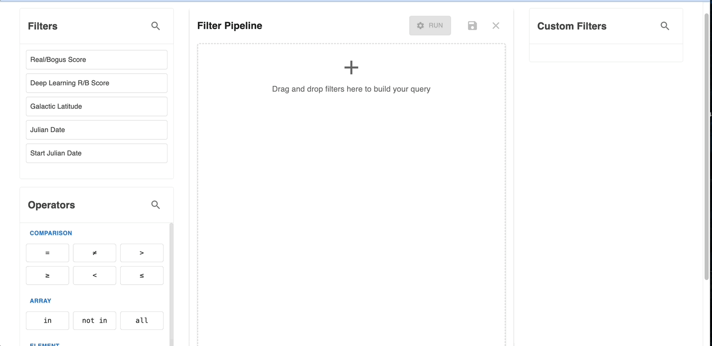
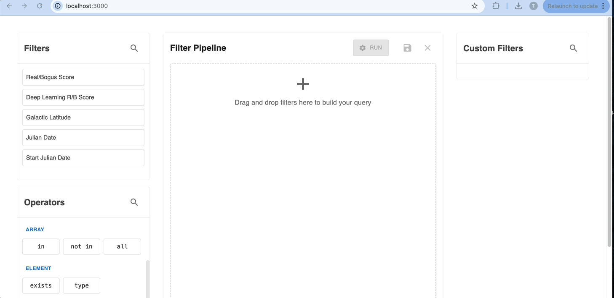
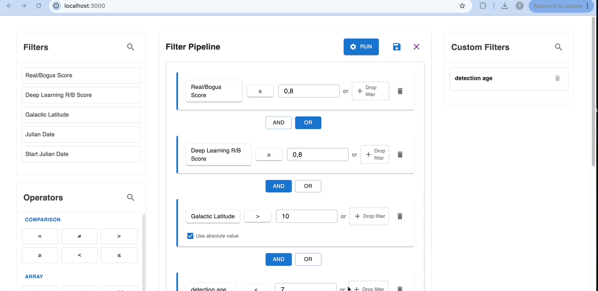

# Filter Building Tool

This project is a React-based application for building and managing custom filters, with a backend server using Flask and MongoDB.

## Table of Contents

- [Installation](#installation)
- [Usage](#usage)
- [Project Structure](#project-structure)
- [API Endpoints](#api-endpoints)
- [Note](#note)
  
## Installation

### Prerequisites

- Node.js and npm
- Python 3.x
- MongoDB

### Frontend Setup

1. Clone the repository:
    ```sh
    git clone https://github.com/thomasculino/filterBuilder.git
    cd filterBuilder
    ```

2. Install the dependencies:
    ```sh
    npm install
    ```

3. Start the development server:
    ```sh
    npm start
    ```

### Backend Setup

1. Create a virtual environment:
    ```sh
    python -m venv venv
    ```

2. Activate the virtual environment:

    - On Windows:
        ```sh
        venv\Scripts\activate
        ```
    - On macOS/Linux:
        ```sh
        source venv/bin/activate
        ```

3. Install the dependencies:
    ```sh
    pip install -r requirements.txt
    ```

4. Start the Flask server:
    ```sh
    python server/app.py
    ```

### Populate the Database (Optional)

If you want to populate the MongoDB database with sample data, you can use the provided script:

1. Ensure MongoDB is running.
2. Run the script:
    ```sh
    python populate_mongodb.py
    ```

## Usage

1. Open your browser and navigate to `http://localhost:3000`.
2. Use the interface to create, manage, and run custom filters.
3. See some examples:<br />
   - [Create a Filter Step](#create-filter-step)
   - [Save Custom Filter](#save-custom-filter)
   - [Create a Complex Query](#create-a-complex-query)
   - [Run a Query](#run-a-query)

### Create Filter Step

Creating a filter step can be done by simply dragging elements to the Filter Pipeline canvas.<br />



### Save Custom Filter

Saving a custom filter can be done by filling at least one filter step. Once saved, the custom filter appears in the Custom Filters section. <br />



### Create a Complex Query

Creating a complex query can be done by creating several filter steps. Each time a new step is added, the user can choose between the AND and OR operators (default: AND). Custom filters can also be used to create new filter steps and even more complex queries. <br />


### Run a Query

Running a query is done by clicking the Run button which will autoscroll to the query results. This section includes the response to the query as well as the number of results found.



## Project Structure

```
caltech_test/
├── node_modules/               # Node.js dependencies
├── server/                     # Backend server code
│   └── app.py                  # Flask application
├── src/                        # Frontend source code
│   └─ components/              # React components
│       |─ FilterBuilder.js     # Filter builder component
│       └─ FilterField.js       # Filter field component
│   ├── App.js                  # Main React component
│   └── index.js                # Entry point for React
├── .gitignore                  # Git ignore file
├── eslint.config.mjs           # ESLint configuration
├── package.json                # Node.js dependencies and scripts
├── populate_mongodb.py         # Script to populate MongoDB with sample data
├── README.md                   # Project documentation
└── requirements.txt            # Python dependencies
```

## API Endpoints

### `POST /run-query`

Executes a MongoDB query or aggregation pipeline.

- Request Body:
    ```json
    {
        "query": [ ... ],
        "isAggregation": true
    }
    ```

- Response:
    ```json
    {
        "results": [ ... ]
    }
    ```

### `POST /save-filter`

Saves a new filter to the database.

- Request Body:
    ```json
    {
        "label": "Filter Name",
        "description": "Filter description",
        "steps": [ ... ],
        "operators": [ ... ],
        "type": "customFilter",
        "screenshot": "data:image/png;base64,..."
    }
    ```

- Response:
    ```json
    {
        "success": true,
        "id": "filter_id"
    }
    ```

### `GET /get-filters`

Retrieves all saved filters from the database.

- Response:
    ```json
    [
        {
            "_id": { "$oid": "filter_id" },
            "label": "Filter Name",
            "description": "Filter description",
            "steps": [ ... ],
            "operators": [ ... ],
            "type": "customFilter",
            "screenshot": "data:image/png;base64,..."
        },
        ...
    ]
    ```

### `GET /get-filter/:filter_id`

Retrieves a specific filter by its ID.

- Response:
    ```json
    {
        "_id": { "$oid": "filter_id" },
        "label": "Filter Name",
        "description": "Filter description",
        "steps": [ ... ],
        "operators": [ ... ],
        "type": "customFilter",
        "screenshot": "data:image/png;base64,..."
    }
    ```

### `DELETE /delete-filter/:filter_id`

Deletes a specific filter by its ID.

- Response:
    ```json
    {
        "success": true
    }
    ```

## Note

All the operators are not functional yet. They require more backend work. Only the comparison and math ones are currently functioning as intended.

